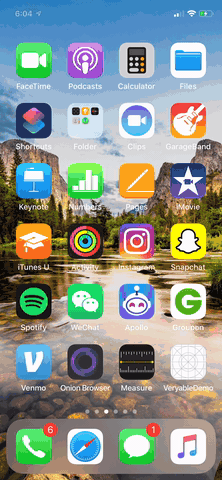

# VeryableChallenge
Code Challenge for Veryable LLC

## Thought Processes
I want to thank you for providing the starter project - it provided me with several ideas and files that allowed me to create this final product. But, I quickly realized that the starter project intended for candiates to create a programmatic UI. Indeed, there are two main ways to develop UI - storyboards or programmatic. In order to get this project in by Friday, May 1st I decided to create a storyboard based UI based on the wireframe design given in the project files. 

## Next Steps & Issues 
Again, in the interest of time I decided against using the alamofire JSON parsing meathod, instead opting for swift's internal decodable protocol to parse the URL given in the project files. The next steps I would take are to clean up the code and find improvements to memory, error handling, and general best practices. 

## Comments
I want to learn programmatic interfaces and how to use the alamofire JSON parser. But, I mentioned to Pooja there were a few other things on my plate that interfered with my ability to complete the project using the starter kit provided. I would most certainly love and welcome the opporutnity to complete the project again using the starter project as a springboard, and do the programmatic UI / alamofire JSON calls but I choose to utilize the skills I already had familiarity with and learn how to use the decodable protocal to avoid having to deal with cocoapods to get the project in by Friday May 1st. 
